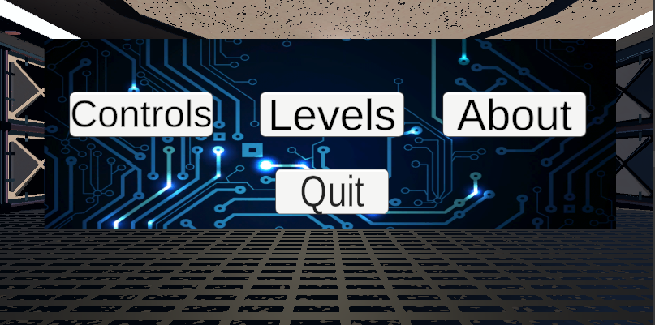
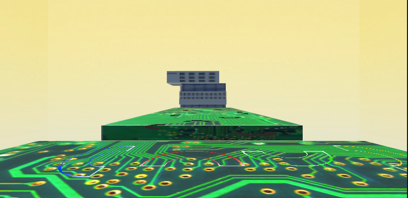

# MixedReality 

Project Week 2022 Mixed Reality 

## Mock VR headset 

-  add an empty game object (WebGL Rig) 

- add a 3D object -> capsule as a child to this object (PlayerBody) 

- add a camera as a child to the capsule (PlayerHead) 

- add a new script to the PlayerBody object (MouseLook) (script can be found under scripts) 

- add a new folder ActionMaps to assets 

- add a input actions object to this folder 

- Now press edit asset and add an action map MouseControls, add a second field to the actions 

- in properties set action type to value and control type to axis 

- under binding -> path select mouse -> delta x for horizontal and delta y for vertical 

- click save asset 

- add the actions to our script, and add the camera (PlayerHead) as the transform 

- add an input action manager script to the WebGL Rig, set its size to 1 and assign the action map we created to it 

- This does not work perfectly at all but allows for some testing without the VR headset 

- The problem seems to occur when moving along both the y and x axis, it works fine when trying to move only one axis. 

## Info 

Index 

Links of interest 

- [intro to unity VR](https://www.youtube.com/watch?v=gGYtahQjmWQ&ab_channel=Valem) 

- [how to make Beatsaber in 10 min in unity](https://www.youtube.com/watch?v=gh4k0Q1Pl7E&ab_channel=Valem) 

# Intro 

-  The project is a mix of Dance Dance Revolution (DDR) and Beatsaber. 

- The goal is that we use physical equipment to manipulate elements in VR. 

- The theme is based on ICT and electronics. 

## The Hub 

The hub of the main menu is divided in these sections: 

-  About: here the player can see more information about the game, for example: the creators of the game and more. 

- Controls: here the player can see what inputs can be used in the game. 

- Levels: here the player can pick a level that they wish to play. 

## The game itself 

The game itself consists of the following pieces: 

-  A part using Beatsaber elements. 

-  A part using DDR elements. 

There are tutorial levels for each aspect of the game shown, after that the game has levels that go from easy to hard. 

# Progress 

 

## 23/02/22 

Pitching our idea to the teachers. Feeling how the VR headset works and make a simple game implementing VR. 

 

## 9/03/22 

The very start of our game. Implementation for the sabers, cutting of blocks and simple models were made. Camera implemented that ended up scrapped. 

 

## 16/03/22 

First time showing our game to the teachers. Beta menu implemented. First music and sounds also added to the game. A score and multiplier for the score was also implemented. First time working with the dance pad. 

 

## 23/03/22 

The DDR-aspect of the game is implemented. The incoming blocks have gotten a visual improvement. Lots of bug fixes. 

 

## 30/03/22 

Menu improved with a setting and levels menu and a visual upgrade. It also works now. Skybox added, sabers obtained a new model and background models added. 

 

## 20/04/22 

Second time showing our game to the teachers. Skybox updated, ground plane got a texture, DDR symbols got a new texture. Added a second level that is DDR only. 

 

## 27/04/22 

Put the game on steam and made sure it worked with the computer from school. The game got some finetuning.

 

# Screenshots 

## Menu 

## Game 

